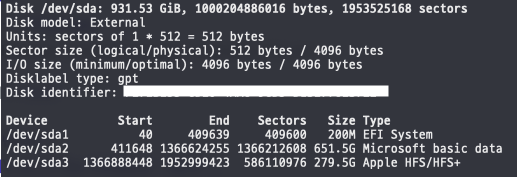
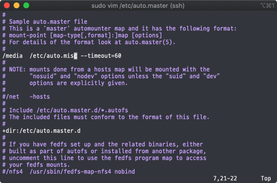
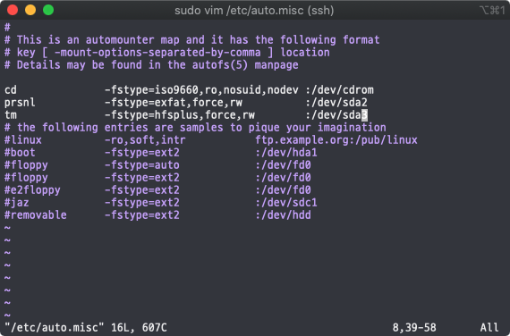
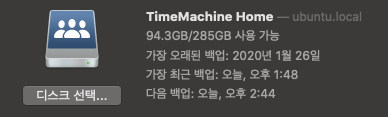

# 라즈베리파이를 타임머신으로 이용하기

## 0. 시작

라즈베리파이는 맥에서 사용하는 백업 솔루션인 타임머신으로 이용가능하다. 기존 인터넷에 돌아다니는 netatalk을 이용한 방법은 오래돼기도 했고, 어떻게 설치했더라도 오류가 많아서 처음에만 백업이 되고 이후에는 갑자기 백업본이 깨지는 일이 발생한다.(적어도 난 그랬다..)  
여기서는 그런 문제 없이 안정적으로 라즈베리파이를 타임머신으로 사용하는 방법을 소개한다. 또한 fstab을 이용한 자동마운트방법이 아닌 autofs를 이용한 자동마운트방법을 소개한다.

ref.<https://www.reddit.com/r/homelab/comments/83vkaz/howto_make_time_machine_backups_on_a_samba/>

## 1. 라즈베리파이 준비

- 라즈베리파이(버젼은 상관 없는 듯)
- 라즈비안 또는 우분투
- 타임머신 백업을 위한 외장하드

## 2. AutoFS를 이용한 자동마운트 설정

타임머신 설정을 하기 전에 AutoFS를 이용한 마운트설정을 한다.

### 1. 준비

``` sh
sudo apt install autofs hfsplus hfsutils hfsprogs
sudo fdisk -l
```

위 명령어로 외장하드의 위치를 알아낸다.  
  
여기서는 /dev/sda3에 위치해 있다.  

### 2. 설정파일 세팅

autofs설정에는 auto.master파일과 auto.misc파일을 수정하면 된다.

``` sh
sudo vim /etc/auto.master
```

아래와 같이 [마운트할 위치,   /etc/auto.misc --timeout=60]을 입력한다.  


``` sh
sudo vim /etc/auto.misc
```

아래와 같이 `tm   -fstype=hfsplus,force,rw   :/외장하드/위치`을 입력한다.  


tm이 타임머신에서 사용할 외장하드의 마운트위치이다. 위와 같이 설정하게 되면 /media/tm에 마운트된다.

## 3. 본격적인 설치

타임머신으로 사용하기 위해서는 Avahi-daemon, samba 를 사용한다.

### 1. Avahi-daemon 설치

``` sh
sudo apt install avahi-daemon -y
```

( -y는 패키지 설치할 때 자동으로 승낙을 해준다.)

### 2. 설정파일 세팅

``` sh
sudo vim /etc/avahi/services/timemachine.service
```  

아래 코드를 복사하여 붙여넣기한다.  

``` json
<?xml version="1.0" standalone='no'?>
<!DOCTYPE service-group SYSTEM "avahi-service.dtd">
<service-group>
 <name replace-wildcards="yes">%h</name>
 <service>
   <type>_smb._tcp</type>
   <port>445</port>
 </service>
 <service>
   <type>_device-info._tcp</type>
   <port>0</port>
   <txt-record>model=RackMac</txt-record>
 </service>
 <service>
   <type>_adisk._tcp</type>
   <txt-record>sys=waMa=0,adVF=0x100</txt-record>
   <txt-record>dk0=adVN=TimeMachine Home,adVF=0x82</txt-record>
 </service>
</service-group>
```

`<txt-record>dk0=adVN=TimeMachine Home,adVF=0x82</txt-record>`는  
  
위와 같이 타임머신에서 보일 이름이다.
나머지는 바꿀 필요 없다.

### 3. Samba 설치

``` sh
sudo apt install samba
```

### 4. 설정파일 세팅

``` sh
sudo mv /etc/samba/smb.conf /etc/samba/smb.conf.bak
sudo vim /etc/samba/smb.conf
```

아래 코드를 복사하여 붙여넣기한다.

``` json
[global]
# Basic Samba configuration
server role = standalone server
passdb backend = tdbsam
obey pam restrictions = yes
security = user
printcap name = /dev/null
load printers = no
socket options = TCP_NODELAY IPTOS_LOWDELAY SO_RCVBUF=524288 SO_SNDBUF=524288
server string = Samba Server %v
map to guest = bad user
dns proxy = no
wide links = yes
follow symlinks = yes
unix extensions = no
acl allow execute always = yes
log file = /var/log/samba/%m.log
max log size = 1000

# Special configuration for Apple's Time Machine
fruit:model = MacPro
fruit:advertise_fullsync = true
fruit:aapl = yes

## Definde your shares here
[TimeMachine Home]
path = /타임머신/백업할/위치
valid users = pi
writable = yes
durable handles = yes
kernel oplocks = no
kernel share modes = no
posix locking = no
vfs objects = catia fruit streams_xattr
ea support = yes
browseable = yes
read only = No
inherit acls = yes
fruit:time machine = yes
```

samba와 autofs를 라즈베리파이를 재시동할 때 마다 자동 시작되게 한다.

``` sh
sudo systemctl enable smbd
sudo systemctl enable autofs
```

마지막으로 라즈베리파이를 재시동해준다.

``` sh
sudo shutdown -r now
```

## 4. 결론

이제 라즈베리파이는 타임머신이 되었다. 맥에서 타임머신 설정을 하고 라즈베리파이와 같은 네트워크에 위치하기만 하면 알아서 타임머신이 작동해서 백업을 한다.
